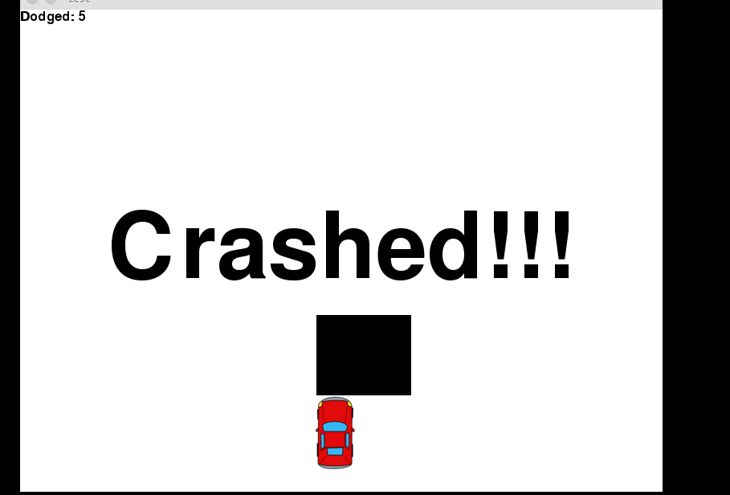

# PyGame: Car obsticale course

Basic example on how to use pygame to create a game. 
(Source code is copied from pythonprogramming.net)

## Game

## References

- [Sentdex youtube playlist: Game Development in Python3 with PyGame](https://www.youtube.com/watch?list=PLQVvvaa0QuDdLkP8MrOXLe_rKuf6r80KO&v=ujOTNg17LjI)

- [Pythonprogramming.net](https://pythonprogramming.net/pygame-python-3-part-1-intro/)
